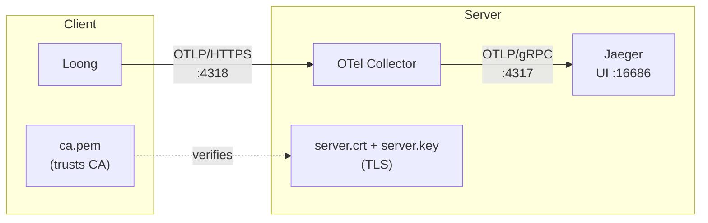

# Agent Observability

Loong is instrumented with OpenTelemetry for distributed trace analysis. This directory provides a ready-to-use observability stack built on the OpenTelemetry Collector and Jaeger, with TLS enabled by default.

## Architecture



- **Loong** exports traces via OTLP/HTTPS to the Collector.
- **OTel Collector** receives, batches, and forwards traces to Jaeger.
- **Jaeger** stores traces and provides a web UI for visualization.

### TLS Certificate Roles

| File | Deployed to | Purpose |
|------|-------------|---------|
| `ca.key` | CA machine only (or offline storage) | Signs server certificates. **Never distribute to clients.** |
| `ca.pem` | All clients (Loong machines) | Client uses it to verify the server certificate's signature. |
| `server.crt` | Server (OTel Collector) | Presented to clients to prove the server's identity. |
| `server.key` | Server (OTel Collector) | Decrypts incoming TLS traffic from clients. |

## Step-by-Step Setup

### Step 1: Generate TLS Certificates (one-time)

```bash
cd deploy/observability
./generate-certs.sh
```

This creates a self-signed CA and a server certificate in `certs/`:

```
certs/
├── ca.key       ← CA private key (keep safe, do not distribute)
├── ca.pem       ← CA certificate (distribute to all clients)
├── server.crt   ← Server certificate (deploy to Collector)
└── server.key   ← Server private key (deploy to Collector)
```

The server certificate includes SAN entries for `localhost`, `otel-collector`, and `127.0.0.1`, so it works whether Loong connects from the host or from inside Docker.

### Step 2: Start the Observability Stack (server side)

```bash
docker compose up -d
```

This starts two containers:

| Container | Ports | Role |
|-----------|-------|------|
| `otel-collector` | 4318 (HTTPS), 4317 (gRPC) | Receives traces from Loong, forwards to Jaeger |
| `jaeger` | 16686 (HTTP) | Trace storage and web UI |

The Collector loads its TLS config from `otel-collector-config.yaml`, which references `server.crt` and `server.key` mounted into the container via `docker-compose.yml`.

Verify the stack is running:

```bash
docker compose ps
curl -k https://localhost:4318/   # should return "200 OK"
```

### Step 3: Configure Loong (client side)

Export the following environment variables before running Loong:

```bash
export LOONG_OTEL_CAPTURE_CONTENT=1
export OTEL_EXPORTER_OTLP_ENDPOINT=https://localhost:4318
export OTEL_CA_CERT_FILE=$(pwd)/certs/ca.pem
```

| Variable | Purpose |
|----------|---------|
| `LOONG_OTEL_CAPTURE_CONTENT` | Include request/response content in traces (for debugging). |
| `OTEL_EXPORTER_OTLP_ENDPOINT` | Collector's OTLP/HTTPS endpoint. |
| `OTEL_CA_CERT_FILE` | Path to `ca.pem`. Loong's HTTP client uses this to verify the Collector's TLS certificate. **Required** because the certificate is self-signed (not in the system trust store). |

Then start Loong as usual:

```bash
loong ...
```

### Step 4: View Traces

Open the Jaeger UI in your browser:

```
http://localhost:16686
```

Select the `loong` service from the dropdown and click "Find Traces".

## Endpoints

| Service | Endpoint | Description |
|---------|----------|-------------|
| OTel Collector OTLP/HTTPS | `https://localhost:4318` | Receive traces from Loong (TLS enabled) |
| OTel Collector OTLP/gRPC | `localhost:4317` | gRPC endpoint (no TLS in this example) |
| Jaeger UI | `http://localhost:16686` | Visualize traces |

## Production Notes

- Replace the self-signed certificates in `certs/` with certificates from your organization's PKI or a public CA (e.g. Let's Encrypt). When using a public CA, `OTEL_CA_CERT_FILE` is not needed because the CA is already in the system trust store.
- Rotate certificates before expiry (default: 10 years for self-signed).
- Set `LOONG_OTEL_CAPTURE_CONTENT=0` in production to avoid leaking sensitive data in traces.
